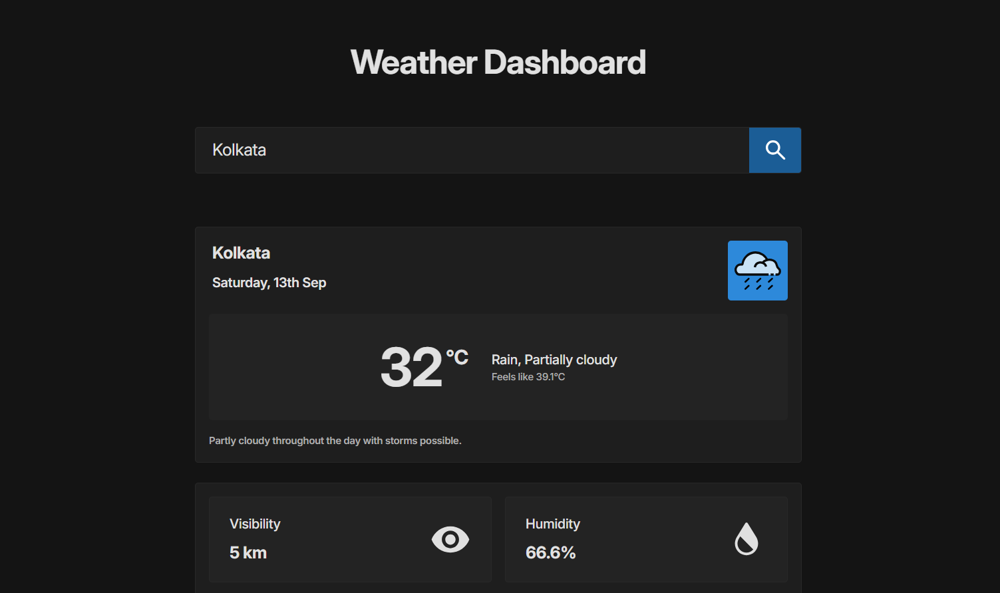

# Weather Dashboard App

A sleek, responsive weather application that provides current weather data and weekly forecasts for any location around the world. This project was built as part of [The Odin Project](https://www.theodinproject.com/) curriculum.



## Live Demo

You can see the app in action here: [Weather Dashboard Live Demo](https://whatisaprocoder.github.io/odin-weather-app/)

## Features

- **Current Weather Display**: Get real-time weather data for any location
- **Auto-location Detection**: Automatically fetches weather for your current location
- **Weekly Forecast**: View a 7-day weather forecast
- **Detailed Metrics**: View comprehensive weather metrics including:
  - Temperature (current, feels like, min/max)
  - Wind (speed and direction)
  - Humidity, Dew Point, and UV Index
  - Visibility and Cloud Cover
  - Precipitation details
  - Atmospheric Pressure
- **Responsive Design**: Works well on both desktop and mobile devices
- **Dynamic Weather Icons**: Icons change based on weather conditions

## Technologies Used

- **JavaScript**: Vanilla JavaScript with ES6+ features
- **HTML/CSS**: Modern HTML5 and CSS3 with Tailwind CSS
- **Webpack**: For bundling and building the application
- **APIs**:
  - Visual Crossing Weather API: For weather data
  - Browser Geolocation API: For obtaining user's current location
- **date-fns**: For date formatting and manipulation

## Project Structure

The project follows a modular architecture for better organization and maintainability:

```
src/
├── index.js               # Main entry point
├── template.html          # HTML template
├── css/                   # Styling
├── fonts/                 # Font files
├── icons/                 # Weather and UI icons
├── js/
    ├── core/              # Core functionality
    │   ├── APIs/          # API integrations
    │   └── utils/         # Utility functions
    └── ui/                # User interface components
        ├── components/    # Reusable UI components
        ├── modules/       # UI-related modules
        └── pages/         # Page layouts
```

## How It Works

### Core Components

1. **APIs**:

   - `WeatherAPI.js`: Fetches weather data from Visual Crossing API
   - `GeolocationAPI.js`: Gets user's current location coordinates

2. **Utils**:

   - `DataExtractor.js`: Parses and formats the weather API response
   - `DirectionParser.js`: Converts wind direction angles to cardinal directions
   - `DisplayJSON.js`: Utility for displaying JSON data (used for debugging)

3. **UI Components**:
   - `WeatherMetricCard.js`: Displays individual weather metrics
   - `WeatherForecastCard.js`: Displays daily forecast information
   - `DynamicIconSet.js`: Manages weather condition icons
   - `MainPage.js`: Main page layout and functionality

### App Flow

1. When the app loads, it attempts to get the user's current location
2. Weather data is fetched for that location using the Visual Crossing API
3. Current conditions and forecast data are extracted and displayed
4. Users can search for weather in any location using the search bar

## Getting Started for Developers

### Prerequisites

- Node.js and npm installed on your machine
- A Visual Crossing Weather API key (already included in the code)

### Installation

1. Clone the repository:

   ```
   git clone https://github.com/whatisaProCoder/odin-weather-app.git
   cd odin-weather-app
   ```

2. Install dependencies:

   ```
   npm install
   ```

3. Start the development server:

   ```
   npm run dev
   ```

4. Build for production:
   ```
   npm run build
   ```

### Development Scripts

- `npm run dev`: Start the development server with hot reloading
- `npm run build`: Build the project for production
- `npm run tailwind-cli:watch`: Watch for CSS changes and compile Tailwind CSS
- `npm run deploy:upload`: Deploy the app to GitHub Pages

## API Keys

The project uses the following API key:

- Visual Crossing Weather API: `CH7MUQRZ58S76FYJBJNPY87VQ`

**Note**: This API key is included for demonstration purposes. In a real-world application, you should store API keys securely using environment variables.

## Customization

### Adding New Weather Metrics

To add a new weather metric:

1. Update the `DataExtractor.js` to include the new data point
2. Add the metric to the `metrics` array in `MainPage.js`
3. Create an icon for the metric in the `icons` folder if needed

### Changing the Theme

The app uses Tailwind CSS for styling with custom color classes. To change the theme:

1. Modify the color values in the inline classes or update the `tailwind.config.cjs` file
2. Run `npm run tailwind-cli:watch` to compile the changes

## Browser Compatibility

This app has been tested and works well in:

- Chrome (latest)
- Firefox (latest)
- Edge (latest)
- Safari (latest)

## Contributing

Contributions are welcome! Feel free to submit issues or pull requests.

## Acknowledgements

- Weather data provided by [Visual Crossing](https://www.visualcrossing.com/)
- Project created as part of [The Odin Project](https://www.theodinproject.com/) curriculum
- Icons adapted from various open-source icon sets

## License

This project is licensed under the ISC License.
